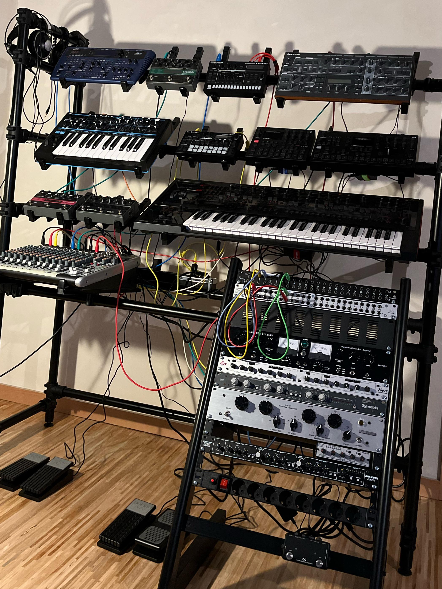

# Synth manuals

Synthesizer, mixer, fx, manuals

[Access](../../tree/master/access/),
[Alesis](../../tree/master/alesis/),
[Behringer](../../tree/master/behringer/),
[Boss](../../tree/master/boss/),
[DBX](../../tree/master/dbx/),
[Drawmer](../../tree/master/drawmer/),
[Elektron](../../tree/master/elektron/),
[Empirical Labs](../../tree/master/empirical-labs/),
[Eventide](../../tree/master/eventide/),
[FMR](../../tree/master/fmr/),
[Klark Teknik](../../tree/master/klark-teknik/),
[M-Audio](../../tree/master/m-audio/),
[Novation](../../tree/master/novation/),
[Roland](../../tree/master/roland/),
[Symetrix](../../tree/master/symetrix/),
[Thermionic Culture](../../tree/master/thermionic-culture/),
[Waldorf](../../tree/master/waldorf/)

## Connections

|                     | Input      | Output            | Inserts                |
|:--------------------|:----------:|:-----------------:|:----------------------:|
| Behringer XQ2442USB | Unbalanced | Unbalanced        | Tip=Output,Ring=Return
| Eventide Space      | Unbalanced | Unbalanced        |
| Elektron Syntakt    |            | Balanced          |
| FMR RNLA            | Unbalanced | Balanced          |    
| Novation BS2        |            | Unbalanced        |
| Roland JD-XA        |            | Balanced          |
| Waldorf µWave 2     |            | Unbalanced        |

